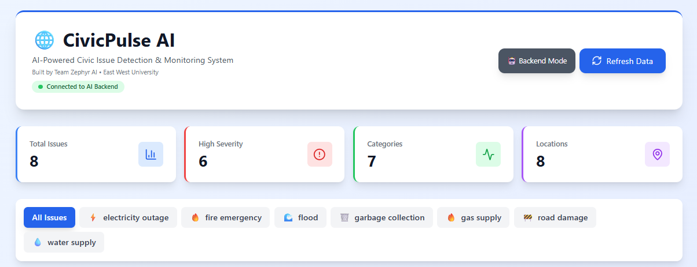
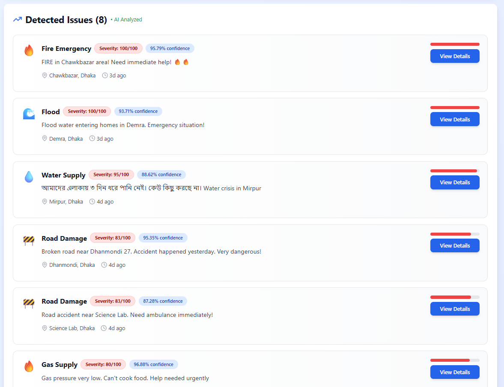

# 🌐 CivicPulse AI

> **Transforming Social Media Insights into Actionable Civic Solutions**

[](https://reactjs.org/)
[](https://www.python.org/)
[](https://huggingface.co/)

**Built by Team Zephyr AI** | East West University | SOLVIO AI Hackathon 2025

---

## 🎯 Problem Statement

Every day, thousands of citizens post complaints about **water shortages**, **power outages**, **road damage** &  **emergencies** on social media. But these posts:
- Get buried in feeds
- Never reach authorities
- Lack systematic tracking
- Result in delayed or no response

**Result**: Small problems escalate into community crises.

---

## 💡 Our Solution

**CivicPulse AI** is an intelligent dashboard that:

✅ **Automatically scans** public text data (social posts, citizen messages)  
✅ **Detects & categorizes** civic issues using AI/NLP  
✅ **Prioritizes** problems by severity score  
✅ **Visualizes** insights for quick action  
✅ **Supports** both Bangla & English (Banglish)

---

## 🚀 Key Features

| Feature | Description |
|---------|-------------|
| 🤖 **AI-Powered Detection** | Uses advanced NLP (BERT) for text classification |
| 📊 **Severity Scoring** | Intelligent algorithm prioritizes emergencies (0-100 scale) |
| 🗺️ **Location Tracking** | Maps issues to specific areas |
| 🏷️ **Smart Categorization** | 9 categories: Water, Electricity, Roads, Garbage, Gas, Flood, Fire, Medical, Crime |
| 🌐 **Multi-Language** | Processes Bangla, English & Banglish text |
| 📱 **Responsive Design** | Works on mobile, tablet & desktop |
| ⚡ **Real-Time Updates** | Instant dashboard refresh |

---

## 🛠️ Technology Stack

### **Frontend**
- **React.js** - UI framework
- **Tailwind CSS** - Styling
- **Lucide React** - Icons
- **Recharts** - Data visualization

### **Backend**
- **Python 3.8+** - Core language
- **Flask** - Web framework
- **Flask-CORS** - Cross-origin support

### **AI/ML**
- **Transformers** - Hugging Face NLP library
- **BERT Model** - Zero-shot classification
- **PyTorch** - Deep learning framework

### **Database** (Planned)
- **MongoDB** - NoSQL database

### **Deployment**
- **Vercel** - Frontend hosting
- **Render/Railway** - Backend hosting

---

## 📸 Screenshots

### Dashboard Overview


### Detected Issues


---

## ⚙️ Installation & Setup

### Prerequisites
- Node.js 14+ and npm
- Python 3.8+
- Git

### **Backend Setup**

```bash
# Clone repository
git clone https://github.com/yourusername/civicpulse-ai.git
cd civicpulse-ai/backend

# Create virtual environment
python -m venv venv

# Activate virtual environment
# Windows:
venv\Scripts\activate
# Mac/Linux:
source venv/bin/activate

# Install dependencies
pip install -r requirements.txt

# Run backend server
python app.py
```

Backend runs on `http://localhost:5000`

### **Frontend Setup**

```bash
# Navigate to frontend
cd ../frontend

# Install dependencies
npm install

# Start development server
npm start
```

Frontend runs on `http://localhost:3000`

---

## 🌐 Deployment

### **Frontend (Vercel)**
1. Push code to GitHub
2. Import project to Vercel
3. Auto-deploy → Get production URL

### **Backend (Render)**
1. Create new Web Service on Render
2. Connect GitHub repository
3. Set build command: `pip install -r requirements.txt`
4. Set start command: `python app.py`
5. Deploy → Get API URL

---

## 📊 How It Works

```
┌─────────────────┐
│ Social Media    │
│ Posts / Text    │
└────────┬────────┘
         │
         ▼
┌─────────────────┐
│ NLP AI Model    │
│ (BERT)          │
│ Classification  │
└────────┬────────┘
         │
         ▼
┌─────────────────┐
│ Category +      │
│ Severity Score  │
└────────┬────────┘
         │
         ▼
┌─────────────────┐
│ Interactive     │
│ Dashboard       │
└─────────────────┘
         │
         ▼
┌─────────────────┐
│ Authorities     │
│ Take Action     │
└─────────────────┘
```

---

## 🎯 Target Users

### **Primary Users**
- 🏛️ Local Government Bodies (City Corporations, Municipalities)
- ⚡ Public Utility Providers (Water, Gas, Electricity)
- 🤝 NGOs focused on urban development

### **Beneficiaries**
- 👥 Urban citizens (millions)
- 🏘️ Community organizations
- 📰 Journalists & activists

---

## 📈 Impact Metrics

| Metric | Target |
|--------|--------|
| **Users (Year 1)** | 10,000+ |
| **Users (Year 2)** | 100,000+ |
| **Response Time Reduction** | 40-60% |
| **Issues Detected Daily** | 500+ |
| **Cities Covered** | 10+ |

---

## 🔮 Future Roadmap

### **Phase 1** (Current - Prototype)
✅ Core NLP classification  
✅ Severity scoring algorithm  
✅ Interactive dashboard  
✅ Mock data integration  

### **Phase 2** (Next 1 months)
🔄 Facebook Graph API integration  
🔄 Twitter API integration  
🔄 Real-time data streaming  
🔄 User authentication  

### **Phase 3** (3 months)
🔜 Mobile app (iOS/Android)  
🔜 SMS/WhatsApp alerts  
🔜 Advanced analytics & reporting  
🔜 Multi-city deployment  

### **Phase 4** (Long-term)
🔜 Citizen feedback portal  
🔜 AI-powered response suggestions  
🔜 Integration with 311 systems  
🔜 Predictive analytics  

---

## 🧪 Testing

```bash
# Run backend tests
cd backend
python -m pytest tests/

# Run frontend tests
cd frontend
npm test
```

---

## 🤝 Contributing

We welcome contributions! Please follow these steps:

1. Fork the repository
2. Create a feature branch (`git checkout -b feature/AmazingFeature`)
3. Commit changes (`git commit -m 'Add AmazingFeature'`)
4. Push to branch (`git push origin feature/AmazingFeature`)
5. Open a Pull Request

---

## 👥 Team Zephyr AI

| Name | Role | Contact |
|------|------|---------|
| Gazi Taoshif | Team Lead / Full-Stack Dev | taoshif2@gmail.com |
| Moinul Islam | ML & Python | piom75sk@gmail.com |
| Abrar Tahsan | C++, CP & UI Design | 2023-3-60-118@std.ewubd.edu |
| Homaira Erin | Research, Documentation, Presentation | homayraerin3@gmail.com |

**Institution**: East West University, Dhaka, Bangladesh

---

## 🙏 Acknowledgments

- **SOLVIO AI Hackathon** for the opportunity
- **Hugging Face** for NLP models and
- **Our mentors and judges** for support

---

---

## 📺 Demo Video

[Watch our demo video](https://youtube.com/your-video)

---

<div align="center">

**Made with ❤️ by Team Zephyr AI**

*Transforming complaints into solutions, one post at a time.*

⭐ Star this repo if you find it useful!

</div>